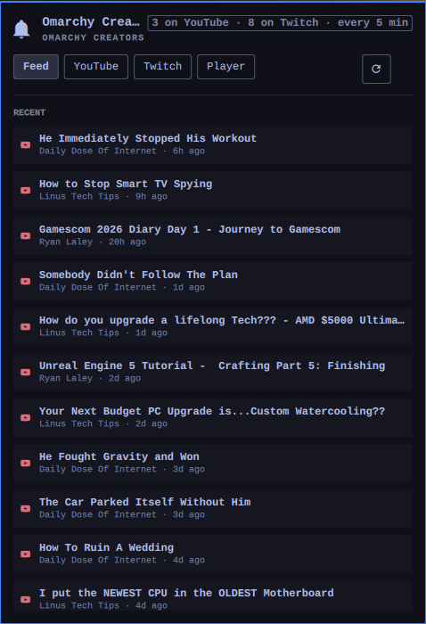
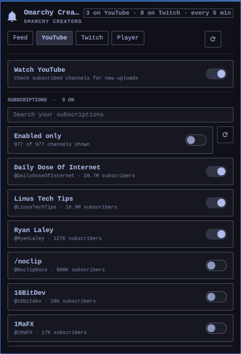
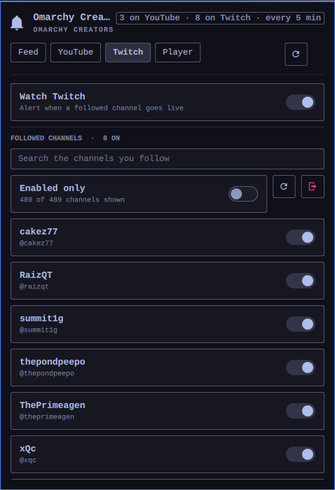
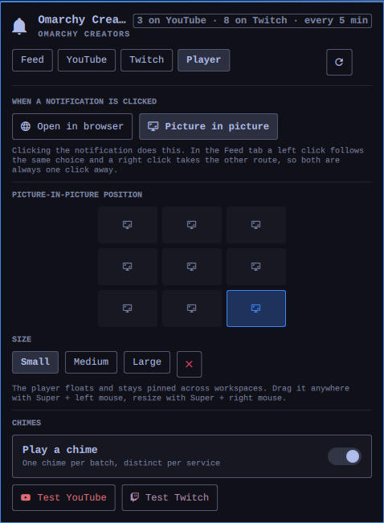

# Omarchy Creators

An Omarchy shell plugin that watches the YouTube channels you subscribe to and
the Twitch channels you follow, and tells you the moment one of them posts a
video or goes live — with a chime, a desktop notification, and a click that
opens the stream either in your browser or in a small picture-in-picture window
you can snap anywhere on screen.

You choose which channels alert you. Everything else stays quiet.

## Screenshots

| Feed | YouTube |
| --- | --- |
|  |  |

| Twitch | Player |
| --- | --- |
|  |  |

## What it does

- **A channel list with a switch on every row.** Both tabs are searchable,
  because a subscription list runs to hundreds of channels. Enabled channels
  sort to the top, and "Enabled only" hides the rest.
- **A chime you can tell apart.** YouTube and Twitch get distinct arpeggios, one
  per batch — ten uploads landing together will not queue ten sounds.
- **A desktop notification** carrying the channel's avatar or the stream's
  thumbnail. For Twitch it also carries the game and the viewer count.
- **Click to watch.** Either the full browser, or a floating mpv window that
  snaps to any of nine screen anchors at three sizes and stays pinned across
  workspaces — while still being draggable and resizable by hand.
- **No alert storms.** A channel you have just switched on is baselined
  silently: alerts start from that moment, not from its back catalogue.

## Requirements

`yt-dlp`, `mpv`, `jq`, `pw-play`, and `notify-send` — all present on a stock
Omarchy install. Python 3 is used for the data helper, stdlib only.

## How each service is read

**YouTube** needs no API key and no quota. The subscription list is read once
from the session in a browser you are already signed into (via yt-dlp's cookie
support), then each enabled channel is polled through its public RSS feed. Set
`cookieBrowser` to `auto` to use the newest signed-in profile found, or to
yt-dlp's `BROWSER:PROFILE` syntax to pin one. Firefox forks such as Zen and
LibreWolf are read as `firefox` pointed at their profile directory.

That RSS endpoint is unreliable in a way that is worth knowing about: it answers
the *same valid feed URL* with 200, 404 and 500 more or less at random once you
poll it with any regularity. A 404 there says nothing about the channel. Each
feed is therefore retried up to four times with an exponential, jittered
backoff. A feed that still will not answer is picked up on the next check, so
the only cost is a late notification, and the panel stays quiet about it — it
speaks up only once more than half the enabled feeds have gone quiet in the
same round, which is the point at which you are looking at a visibly thinner
feed rather than a hiccup.

A machine that has just booted is a separate case: the plugin's first check can
easily beat NetworkManager to the finish, and the errors that come back then say
nothing useful — Twitch reports a name-resolution failure, and yt-dlp reports a
failed webpage download as though your cookies were wrong. When a check finds no
route out at all the panel simply says **Waiting for the network** and tries
again every 20 seconds until there is one.

**Twitch** gates follow lists behind an authorised session — the cookies in your
browser carry a token without the `user:read:follows` scope, and the GraphQL
fields for follows are fenced off — so the plugin signs in properly instead.

The plugin ships with its own Twitch application Client ID, so **nobody
installing it registers anything** — they press **Connect Twitch**, approve the
code in the browser tab that opens, and are done. A Client ID is a public
identifier, not a secret; Chatterino and Streamlink Twitch GUI ship theirs the
same way. There is no client secret anywhere in this plugin.

The id lives in `CreatorsModel.js` as `TWITCH_CLIENT_ID`, with the same value
mirrored into `manifest.json` so the settings UI pre-fills it. Manifest defaults
are *not* merged into what a widget sees at runtime, which is why the constant
is the source of truth and the manifest only follows it. Setting
`twitchClientId` on the widget overrides it, for pointing the plugin at your own
registered app.

To register a replacement: <https://dev.twitch.tv/console/apps>, OAuth redirect
`http://localhost` (unused — the device-code flow does not redirect), Client
Type **Public**, scope `user:read:follows`.

The resulting token is written to
`~/.local/state/omarchy/creators/twitch-token.json` with mode `0600`, and
is refreshed automatically. **Disconnect** deletes it.

## Install

```bash
omarchy plugin add https://github.com/renews/omarchy-creators.git --enable --yes
```

Or, from a checkout in `~/.config/omarchy/plugins/renews.creators/`:

```bash
omarchy-shell shell rescanPlugins
omarchy plugin enable renews.creators --section right
```

The plugin writes nothing outside its own directory, its own state and cache
directories, and its own entry in `shell.json`. It never edits your Hyprland
config: the picture-in-picture window is placed with runtime `hyprctl`
dispatches, so there are no window rules to install or to clean up afterwards.

## Removing it

```bash
omarchy plugin remove renews.creators
```

That disables the plugin and deletes its directory and its `shell.json` entry.
To take everything else with it — including the stored Twitch token:

```bash
rm -rf ~/.local/state/omarchy/creators ~/.cache/omarchy/creators
```

Revoking the plugin's access to your Twitch account is separate, and is done
from <https://www.twitch.tv/settings/connections>. Nothing is left on YouTube's
side to revoke: the plugin only ever reads your existing browser session.

## Using it

Click the bar widget to open the panel.

| | |
|---|---|
| **Feed** | Live channels first, then recent uploads. Left click opens with your configured action, right click takes the other route. |
| **YouTube** | Search your subscriptions and switch on the ones you want. |
| **Twitch** | Connect once, then search your follows and switch them on. |
| **Player** | Where the picture-in-picture window sits, how big it is, and the chimes. |

Right click the bar widget to check right now. With the panel focused, `r`
checks now and `/` jumps to the search field.

The picture-in-picture window floats and stays pinned across workspaces. Drag it
with `Super` + left mouse and resize it with `Super` + right mouse; the nine
anchors in the Player tab are there for when you want it back in a corner.

## Settings

Everything is editable from Setup → Plugins, or inline in `shell.json`.

| Key | Default | |
|---|---|---|
| `refreshIntervalSec` | `300` | How often to check, 60–3600. |
| `youtubeEnabled` / `twitchEnabled` | `true` | Turn a whole service off. |
| `youtubeChannels` / `twitchChannels` | `[]` | Managed by the panel's toggles. |
| `cookieBrowser` | `auto` | Which browser profile holds your YouTube session. |
| `twitchClientId` | shipped | Override to use your own app. |
| `clickAction` | `Browser` | Or `Picture in picture`. |
| `pipPosition` / `pipSize` | `bottom-right` / `medium` | |
| `soundEnabled`, `youtubeSoundPath`, `twitchSoundPath` | `true`, `bundled` | |
| `notificationsEnabled`, `notificationTimeoutSec` | `true`, `12` | `0` never expires. |

## Note on notification buttons

The helper sends `browser` and `pip` as named notification actions, which mako
and dunst draw as buttons. The Omarchy notification daemon invokes only the
`default` action, so on Omarchy a click follows the `clickAction` setting. The
Feed tab's right click is the always-available way to take the other route.

## Layout

| | |
|---|---|
| `Service.qml` | Polling, alerting, sound queue, Twitch sign-in state. |
| `Panel.qml` | Bar widget and the four-tab panel. |
| `CreatorsModel.js` | Pure logic: search, selection, formatting, feed merge. |
| `creators` | Data helper. One JSON document per invocation, always exit 0. |
| `creators-notify` | One notification, and the click it may produce. |
| `creators-pip` | The mpv window and its Hyprland geometry. |

State lives in `~/.local/state/omarchy/creators/` (what has been seen, the
Twitch token, the player's last placement); caches in
`~/.cache/omarchy/creators/` (the channel catalogues and avatars).

## Tests

```bash
node tests/model.test.js     # pure logic
./tests/helper.test.sh       # helper JSON contract and input refusal
```

Neither touches the network, the compositor, or your real state directory.
`tests/make-chimes.py` regenerates the bundled sounds.

## Licence

MIT.
